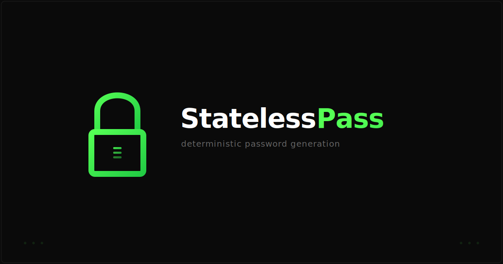

<p align="center">
  
</p>

<h1 align="center">StatelessPass</h1>

<p align="center">
  Deterministic password &amp; TOTP generator. Nothing stored, nothing sent. One master password derives everything.
</p>

<p align="center">
  <a href="https://fantasim.github.io/StatelessPass/">Live App</a>
</p>

---

**Same inputs = same outputs, always.** Your passwords are never saved anywhere -- they're recomputed from your master password + domain + username using PBKDF2-SHA256 (600k iterations).

### Features

- **4 password formats** -- Full (symbols), No Symbols, Alphanumeric, PIN
- **TOTP 2FA** -- generates time-based codes with scannable QR
- **Export** -- download site parameters as JSON
- **Offline** -- works on `file://`, no network requests, no dependencies
- **Single file** -- one `index.html`, fully auditable

### Security

- Zero external requests (CSP: `default-src 'none'`)
- No storage (no cookies, no localStorage, no IndexedDB)
- Clipboard auto-clears after 30 seconds
- [View the entire source](index.html) -- it's one file

### How it works

```
salt    = domain + ":" + username + ":" + counter
derived = PBKDF2(master, salt, 600000 iterations, SHA-256, 512 bits)
```

Byte slices are mapped to character sets to produce each password variant. TOTP uses a separate derivation with `:totp` appended to the salt.

### Run locally

Open `index.html` in any browser. That's it.
